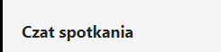

<!-- Example of title -->
My exercise is Markdown
=======================
<!-- Here comes the table of content -->

<!-- Example of paragraph of text with line break -->
This is an example of text with line break.   
Break the line. 

This is the second sentence of this exercise. 
[P] Doing the same with HTML.
<!-- Example of another paragraph -->
This is  very very veeeeeery long sentence in which we will practice one very long sentence.
<!-- Example of bold -->
This is **bold** text.

This is also __bold__ text.
<!-- Example of italic  -->
This is *italic* text.

This is also _italic_ text.

<!-- Example of strikethrough -->
This ~~not a text~~ that I want to show.

<!-- Example of headers -->

# Links and images

## Links

### Links less important

<!-- Example of external link -->

[Webpage on localization](https://github.com/)

<!-- Example of link to another file -->

[Another link to the file but on the Computer](Empty.md)

[File](README.md)

## Images

<!-- Example of an image -->

<!-- Example of an image with hover text -->

<!-- Example of equation or inline code -->

<!-- Example of a block of code -->

<!-- Example of code highlighting -->

<!-- Example of quote -->

<!-- Example of bullet list -->

<!-- Example of numbered list -->

<!-- Example of table -->

<!-- Paragraph after table -->